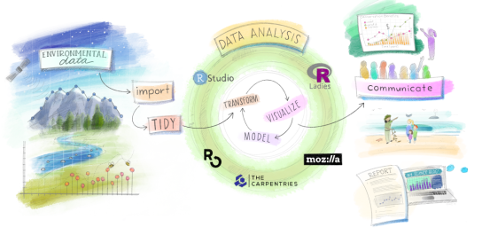
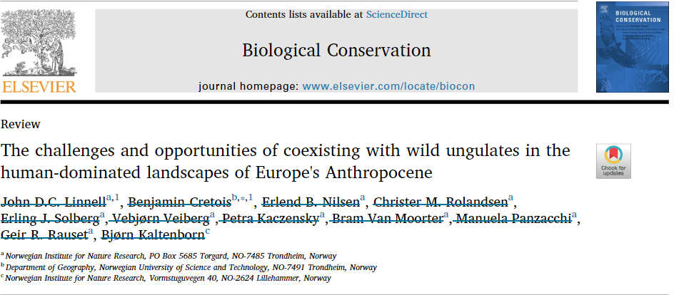
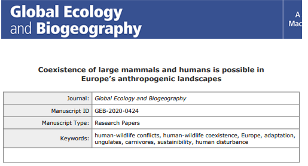

class: inverse, center, middle

# Work 1: GEOG3006 - Quantitative Methods

###Conveying complex concepts to a diverse audience

## `r emo::ji("teacher")`

---
# Work 1

- Teaching the use of R programming and principles of data analysis

- Students from very different backgrounds

- Master level course

- Architecture of the course based on the **workflow of the data scientist**:

```{r, echo = FALSE}

```

---
# Work 1

- I wanted the course to be accessible to **everyone** (not just NTNU students) ...

--

- ... so I created a website:

.center[
**https://bencretois.github.io/GEOG3006/**]

--

- Website made with the R package **Distill** and hosted on **Github**

.center[
```{r, echo = FALSE, out.width="400px"}

```
]

---
class: inverse, center, middle

# Work 2: Some of my PhD work

### Flexibility and adaptability & handling large dataset

## `r emo::ji("stats")`


---
# Work 2

* We **Compiled** different source of data to **make, display and analyze** distribution maps of ungulates species in Europe.

.center[
```{r, echo = FALSE, out.width="600px"}
knitr::include_graphics('distribung.png')
```
]

---
# Work 2

* The data came from **citizen science portals** including GBIF and Artsobservasjoner (large dataset requiring a lot of pre-processing!)

* The analysis required handling large raster and running the model a **Cloud server** (skill that I had to quickly learn)

* This work has involved working in a cross-disciplinary team and resulted in 2 papers for my PhD

---
# Work 2

`r emo::ji('right')` Links to [paper 1](https://www.sciencedirect.com/science/article/pii/S0006320719318312) and [paper 2](https://ecoevorxiv.org/2md94/download?format=pdf)

.center[
```{r, echo = FALSE, out.width="500px"}

```


```{r, echo = FALSE, out.width="500px"}

```
]


---

class: inverse, middle, center

# Thank you for your attention and for considering my application!

### Slides made with the R package **xaringan** and available on my [github](https://github.com/BenCretois/interview_nina)

---