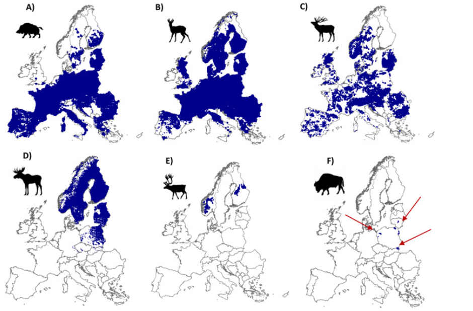
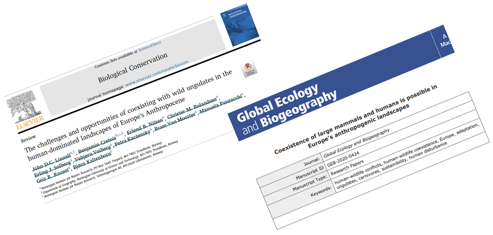
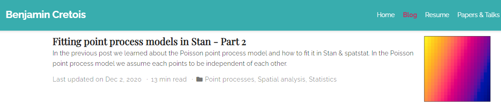
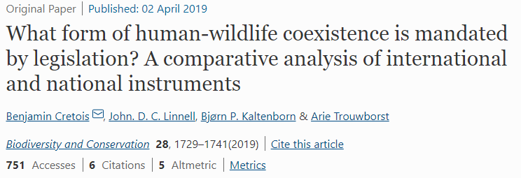
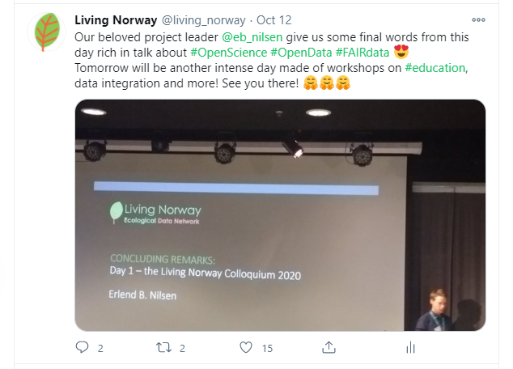
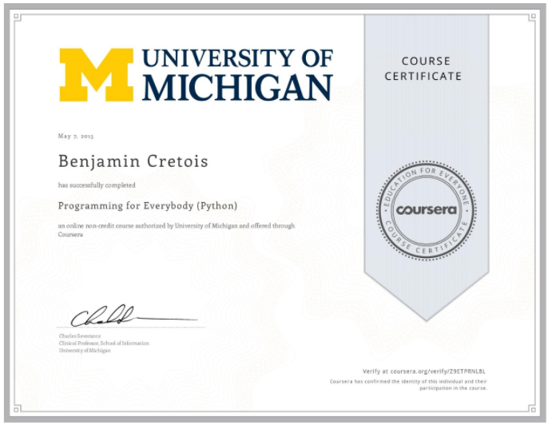
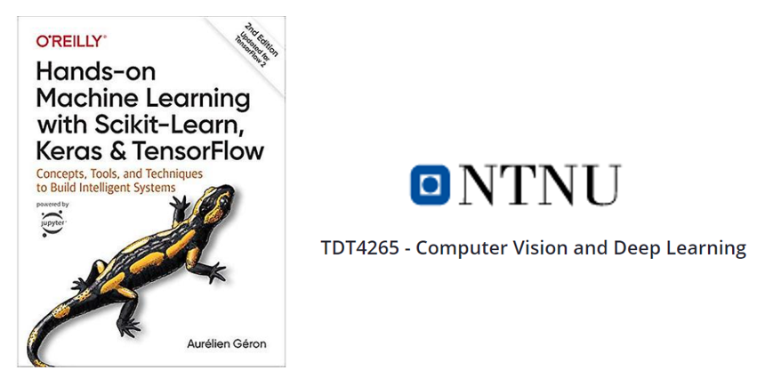

class: inverse, center, middle

# A diverse background

### Providing insights from multiple disciplines!

# `r emo::ji('cap')`

---
# 1 - Background

* A year in **Classes preparatoires** in **Mathematics**

* Two years in the **Navy infantry** as a sergeant 

* Bachelor in **Ecology and Evolution**

* Master in **Environment and Law** - Master thesis done at NINA under the supervision of *JDC Linnell*

* Now PhD Candidate in **Spatial Data Analysis** at NTNU and NINA under the supervision of *Jan Ketil Rød, Erlend B. Nilsen and JDC Linnell*

--

* *Fun fact*: My father is a computer engineer I was actually considering a degree in **Computer Science** after the Navy!

---
class: inverse, center, middle

# 2 - Data Science skills

### Managing, visualizing and analyzing the data

# `r emo::ji('stats')`

---
# 2 - Data science skills

* **Data Science** is a course I co-lead at the Department of Geography!

* We developed a **Quantitative methods** course from scratch for Master students

- I wanted the course to be accessible to **everyone** (not just NTNU students) ...

--

- ... so I created a website **in R** and hosted on **Github**: **https://bencretois.github.io/GEOG3006/**

--

* I am also TA in **GIS Tools for Climate Change Studies**, where I also made the material available on github: https://bencretois.github.io/GEOG3527/

---
# 2 - Data science skills

* We **Compiled** different source of data to **make, display and analyze** distribution maps of ungulates species in Europe.

.center[
```{r, echo = FALSE, out.width="600px"}

```
]

---
# 2 - Data science skills

* The data came from **citizen science portals** including GBIF and Artsobservasjoner, hunting statistics ... (large dataset requiring a lot of pre-processing!)

* The analysis required handling large raster and running the model a **Cloud server**

* I used a Bayesian framework and the **Integrated Nested Laplace Approximation** to build an iCAR model 

* Like most of my work, extensive collaboration with **NINA researchers**!

.center[
```{r, echo = FALSE}

```
]


---
class: inverse, center, middle

# 3 - Communication

### Conveying complex concepts to a diverse audience

# `r emo::ji('speech')`

---
# 3 - Explaining complex analysis and concepts

* I presented my work at the **Conservation Optimism Summit** in Oxford where attendees were mostly non-scientists

* **Transforming Citizen Science for Biodiversity**, the project my PhD is part of is very cross-disciplinary and that is stimulating!

* I am also running a blog where I try to explain simply complex statistical methodologies

.center[
```{r, echo = FALSE}

```
]

---
class: inverse, center, middle

# 4 - Teamwork 

### Participation and collaboration in varied research project

# `r emo::ji('family')`


---
# 4 - Teamwork & project diversity

* While my PhD mainly focus on **spatial data science** I was and I am involved in a diversity of research projects

* In a previous work at NINA with JDC Linnell, I used **K nearest neighbors methods** to cluster environmental legislation

```{r, echo = FALSE}

```

---
# 4 - Teamwork & project diversity

* Now, collaborating on a project at the interface of Machine Learning and Statistics lead by **Bob O'Hara** and **Emily Simmonds**

* The aim is to assess how is **uncertainty** reported in various fields (political science, ecology, economy ...)

* I am also contributing to **Living Norway** and was responsible for the Twitter feed during the 2nd Colloquium

.center[
```{r, echo = FALSE, out.width="400px"}

```
]

---
class: inverse, center, middle

# 5 - Aborbing knowledge quickly

### Flexibility and curiosity!

# `r emo::ji('library')`

---
# 5 - Capacity to learn quickly

* Having a broad range of interests implies learning new methods / technologies fast!

* I learned how to use **Overleaf** (online LaTeX editor) to collaborate with the statisticians

* I learned **Bayesian statistics** on my own and I am now able to build complex models

* I am also use to follow MOOCs to learn more technical skills (Python and HTML, CSS, JS):

.center[
```{r, echo = FALSE, out.width="400px"}

```
]

---
# 5 - Absorbing knowledge quickly

* I was currently planning to learn more about **image recognition algorithms** to work on a camera trap database:

* I learned the basic of **Machine Learning** in Python with Scikit-learn (SVM, Random Forests, KNN; very close to statistical methods!)

* I am now learning **Deep Learning** with TensorFlow and Keras

* I am enrolled on a course on Deep Learning and **Computer Vision** at NTNU

.center[
```{r, echo = FALSE, out.width="500px"}

```
]


---
class: center, inverse

# 6 - Finally, why I would like to work as a Data Scientist at NINA!

--

.RUred[Not be completely detached from the research environment but rather .orange[help researchers do better research]]

--

.RUred[I would like to continue working with .orange[ecological] data while improving my knowledge of CS and ML]

--

.RUred[NINA has great projects (e.g. .orange[Living Norway]) and I would like to contribute to their development]

--

.RUred[NINA has a really .orange[stimulating] environment and cares for its employees!]

---


